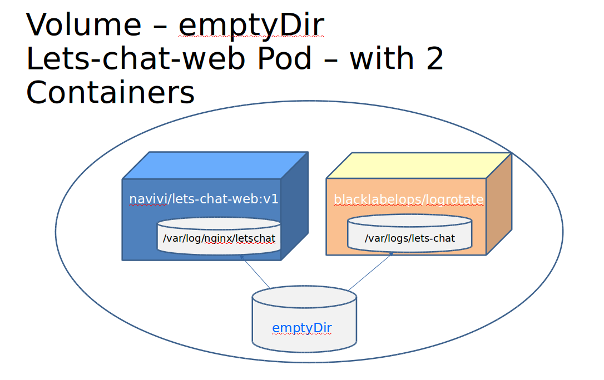

# Task-8: Volume Mount, to 2 Containers in a Pod, the Pod storage

1. Add another container to Lets-Chat-Web Pod. The second conatiner will be 
   responsible to logrotate the log file of Lets-Chat-Web.
   > * The logs of lets-chat-web, nginx controller, are located in **/var/log/nginx/letschat**
   > * The second Container image tag is **blacklabelops/logrotate**
   > * The second Container is not listening on any port
   > * You may come-up with some mount-path for the logs in the second container
   > * You should provide the second container Env variable **LOGS_DIRECTORIES** with the value of the mount-path
   > * Provide the second container another Env variable **LOGROTATE_SIZE** with value 100k, meaning it will rotate when log file exceeds 100 kilobytes.
   > * Create a volume in the pod - of type emptyDir. That volume should be mounted to both containers
2. Open the browser and refresh number of times (Each refresh generates log lines and increase the log file). Then enter the container using **kubectl exec -it ..** and check the directory **/var/log/nginx/letschat**. Do you see rotated log files?
  
### Specifications Examples
#### pod-with-2-containers-sharing-volume.yaml
```yaml
apiVersion: v1
kind: Pod
metadata:
  name: test-pd
spec:
  containers:
  - name: conainer1-name
    image: k8s.gcr.io/test-webserver
    volumeMounts:
    - name: shared-volume
      mountPath: /var/test-pd
  - name: conainer2-name
    image: busy-box
    volumeMounts:
    - name: shared-volume
      mountPath: /etc/my-path
  volumes:
<<<<<<< HEAD
  - name: shared-volume
    emptyDir: {}
```
